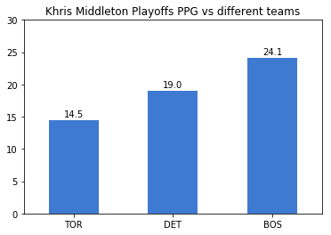
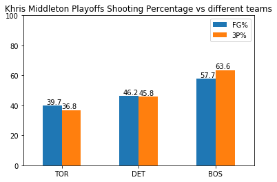

# Does Khris Middleton really plays better when he faces the Celtics?

After watching Khris Middleton torching Celtics defenders in the playoffs in two consecutive years, people think he just summons his inner Michael Jordan when he faces Brad Steven's squad. The question has to be asked: does he really plays better against the Celtics from a statistical standpoint?

[Kaggle version of project] (https://www.kaggle.com/jasonli1030/khris-middleton)

This is a relatively small dataset since it only includes playoff stats from recent years:
* 2017 Playoffs First Round against Toronto Raptors - 6 games
* 2019 Playoffs First Round against Ditroit Pistons - 4 games
* 2018 Playoffs First Round against Boston Celtics - 7 games
* 2019 Playoffs Second Round against Boston Celtics - 2 games (by May 2nd)

Khris Middleton scores 24.1 PPG(points per game) against the Celtics, which is 66% percent higher than his PPG against Toronto and 27% higher than that against Detroit.

What's more ridiculous is his shooting performance. Currently he has the all-time best 3P%(three point percentage) in the playoffs, sitting at 48.8%. But when you look at those stats against the Celtics, his FG%(field goal percentage) is at 57.7% while his 3P% is at 63.6%!

In other words, Khris Middleton is just a regular starter against the Raptors, an all-star caliber against the Pistons and all of a sudden becomes Michael Jordan against the Celtics.
